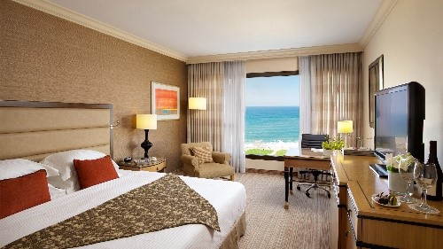
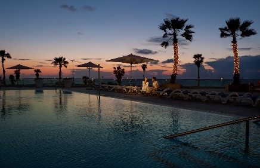
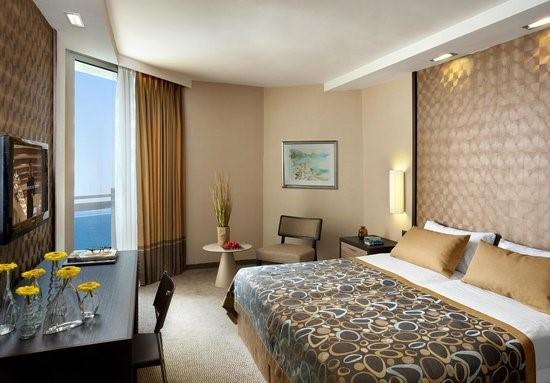
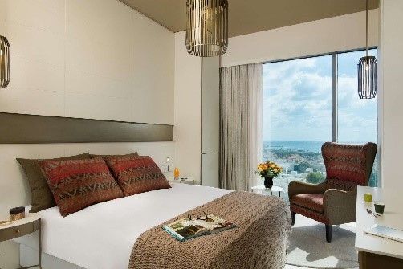
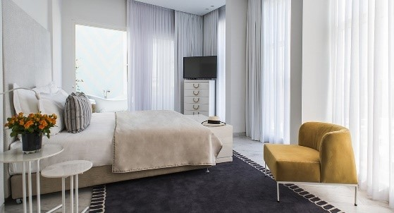
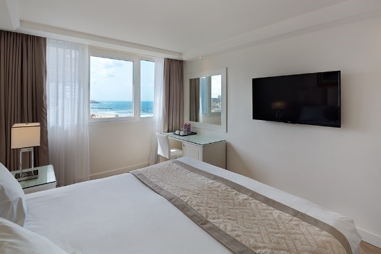

<section markdown="1">
**The Conference is being held during a high season and therefore we
recommend that you book your rooms as early as possible** 
Rooms will be confirmed on a first come, first served basis.

Target Conferences is the official travel agent for the Conference and are offering special reduced rates for accommodation at the conference venue and neighboring hotels. Please book your hotel using the same online form as registering for the conference.

[CLICK HERE](https://knasim.herokuapp.com/owasp2019/register) TO BOOK YOUR ACCOMMODATION

**The travel agent is not mandatory, and of course, you're free to directly book your own hotel.**

Next to these hotels, there are a lot of [AirBnB's](https://www.airbnb.com) in the area.

### Intercontinental David Tel Aviv Hotel (Conference Venue)
Kaufmann St 12, Tel Aviv-Yafo, 61501

|   Room Type   | Single | Double |
|---------------|:------:|:------:|
| Classic Room  |  $370  |  $395  |

*Rates are per room, per night, including breakfast.*

**Official check-in and check-out times:**  
Check-in: 14:00  
Check-out: 12:00

**Early check-in:** if needed before 10:00, you will be charged a one full night stay. After 10:00 until 14:00, you will be charged at 50% of a one full night stay (based on availability only).

**Late check-out:** from 12:00 until 16:00, you will be charged 50% of a one full night stay. After 16:00, you will be charged a one full night stay.

</section>
<section markdown="1">
### Dan Panorama Tel Aviv Hotel
Kaufmann St 10, Tel Aviv-Yafo
*Right next door to the Conference venue, Intercontinental David Tel Aviv Hotel*

|   Room Type   | Single | Double |
|---------------|:------:|:------:|
| Standard Room |  $330  |  $340  |

*Rates are per room, per night, including breakfast.*

**Official check-in and check-out times:**  
Check-in: 15:00  
Check-out: 12:00

</section>
<section markdown="1">
### Rothschild 22
Rothschild Blvd 22, Tel Aviv-Yafo, 6688218
*12 minutes walk from the conference hotel*

|   Room Type   | Single | Double |
|---------------|:------:|:------:|
| Standard Room |  $290  |  $320  |

*Rates are per room, per night, including breakfast.*

**Official check-in and check-out times:**  
Check-in: 15:00  
Check-out: 12:00

</section>
<section markdown="1">
### 65 Hotel
Rothschild Blvd 65, Tel Aviv-Yafo
*18 minutes walk from the conference hotel*

|   Room Type   | Single | Double |
|---------------|:------:|:------:|
| Standard Room |  $280  |  $290  |

*Rates are per room, per night, including breakfast.*

**Official check-in and check-out times:**  
Check-in: 14:30  
Check-out: 12:00

</section>
<section markdown="1">
### Orchid Tel Aviv
HaYarkon St 79, Tel Aviv-Yafo
*18 minutes walk from the conference hotel*

|   Room Type   | Single | Double |
|---------------|:------:|:------:|
| Standard Room |  $290  |  $300  |

*Rates are per room, per night, including breakfast.*

**Official check-in and check-out times:**  
Check-in: 15:00  
Check-out: 12:00

</section>
<section class="inverse" markdown="1">
## Contact
For any questions concerning accommodations and tours, please feel free to contact:  
Target Conferences Ltd.  
Phone:  +972 3 5175150  
Email address: owasp.reg@target-conferences.com

## Payment
In order to book your accommodation, and in order to benefit from the special rates, please complete the on-line accommodation and tours form.
Full payment is required at time of booking.

Payment for accommodation may be made by bank transfer or credit card (Visa, Mastercard, American Express, Diners).
Kindly refer to the on-line registration form.

## Cancellation of accommodation
* Up to 45 days prior to arrival - full refund less handling fee of US$70 per room
* From 45 to 21 days prior to arrival - full refund less cost of one night stay
* Less than 21 days prior to arrival - no refund due

## Important Notes
* Personal travel, luggage and health insurance is recommended.
* Please note that the organizers cannot be responsible for participants lacking appropriate insurance coverage in case of need.

</section>
